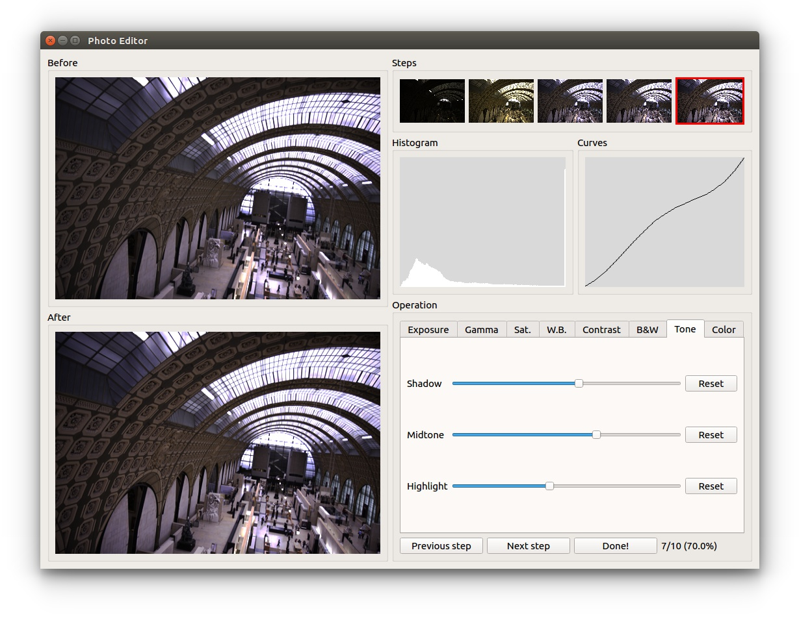

# Exposure:<br>A White-Box Photo Post-Processing Framework
#### ACM Transactions on Graphics (presented at SIGGRAPH 2018)
[Yuanming Hu](http://taichi.graphics/me/)<sup>1,2</sup>, [Hao He](https://github.com/hehaodele)<sup>1,2</sup>, Chenxi Xu<sup>1,3</sup>, [Baoyuan Wang](https://sites.google.com/site/zjuwby/)<sup>1</sup>, [Stephen Lin](https://www.microsoft.com/en-us/research/people/stevelin/)<sup>1</sup>

#### [[Paper](https://arxiv.org/abs/1709.09602)] [[PDF Slides](https://github.com/yuanming-hu/exposure/releases/download/slides/exposure-slides.pdf)] [[PDF Slides with notes](https://github.com/yuanming-hu/exposure/releases/download/slides/exposure-slides-with-notes.pdf)] [[SIGGRAPH 2018 Fast Forward](https://www.youtube.com/watch?v=JdTkKhm0LVU)]

<sup>1</sup>Microsoft Research <sup>2</sup>MIT CSAIL <sup>3</sup>Peking University

**Change log:**
 - July 9, 2018: Minor improvements. 
 - May 20, 2018: Added user study UI. 
 - May 13, 2018: Minor improvements. 
 - March 30, 2018: Added instructions for preparing training data with Adobe Lightroom.
 - March 26, 2018: Updated MIT-Adobe FiveK data set and treatments for 8-bit `jpg` and `png` images.
 - March 9, 2018: Finished code clean-up. Uploaded code and some instructions.
 - March 1, 2018: Added some images. 


# Installation
Requirements: `python3` and `tensorflow`. Tested on Ubuntu 16.04 and Arch Linux. OS X may also work, though not tested. 
```
sudo pip3 install tensorflow-gpu opencv-python tifffile scikit-image
git clone https://github.com/yuanming-hu/exposure --recursive
cd exposure
```
<!-- Make sure you have `pdflatex`, if you want to generate the steps. -->

# Using the pretrained model
 - `python3 evaluate.py example pretrained models/sample_inputs/*.tif`
 - Results will be generated at `outputs/`

# Training your own model
  - `python3 fetch_fivek.py`
    - This script will automatically setup the [`MIT-Adobe FiveK Dataset`](https://data.csail.mit.edu/graphics/fivek/)
    - Total download size: ~2.4GB
    - Only the downsampled and data-augmented image pack will be downloaded. Original dataset is large as 50GB and needs Adobe Lightroom to pre-process the RAW files. If you want to do data pre-processing and augmentation on your own, please follow the instructions [here](https://github.com/yuanming-hu/exposure/wiki/Preparing-data-for-the-MIT-Adobe-FiveK-Dataset-with-Lightroom).
  - `python3 train.py example test`
    - This command will load `config_example.py`,
    - and create a model folder at `models/example/test`
  - Have a cup of tea and wait for the model to be trained (~100 min on a GTX 1080 Ti)
    - The training progress is visualized at folder `models/example/test/images-example-test/*.png`
    - **Legend**: top row: learned operating sequences; bottom row: replay buffer, result output samples, target output samples
  - `python3 evaluate.py example test models/sample_inputs/*.tif` (This will load `models/example/test`)
  - Results will be generated at `outputs/`

# Visual Results

 


All results on the MIT-FiveK training set: https://github.com/yuanming-hu/exposure_models/releases/download/v0.0.1/test_outputs.zip

# FAQ
1) **Does it work on `jpg` or `png` images?**

To some extent, yes. `Exposure` is originally designed for RAW photos, which assumes 12+ bit color depth and linear "RGB" color space (or whatever we get after demosaicing). `jpg` and `png` images typically have only 8-bit color depth (except 16-bit `png`s) and the lack of information (dynamic range/activation resolution) may lead to suboptimal results such as posterization. Moreover, `jpg` and most `png`s assume an `sRGB` color space, which contains a roughly `1/2.2` Gamma correction, making the data distribution different from training images (which are linear).

Therefore, when applying `Exposure` to these images, such nonlinearity may affect the result, as the pretrained model is trained on linearized color space from `ProPhotoRGB`.
  
If you train `Exposure` in your own collection of images that are `jpg`, it is OK to apply `Exposure` to similar `jpg` images, though you may still get some posterization.

Note that `Exposure` is just a prototype (proof-of-concept) of our latest research, and there are definitely a lot of engineering efforts required to make it suitable for a real product. Like many deep learning systems, usually when the inputs are too different from training data, suboptimal results will be generated. Defects like this may be alleviated by more human engineering efforts which are not included in this research project whose goal is simply prototyping.

2) **The images from the datasets are 16-bit. Have you tried 8bit jpg as input? If so, how about the performance?**
I did. We have some internal projects (which I cannot disclose right now, sorry) that actually have only 8-bit inputs. Most results are as good as 16-bit inputs. However, from time to time (< 5% on the dataset I tested) you may find posterization/saturation artifacts due to the lack of color depth (intensity resolution/dynamic range).

3) **Why am I getting different results everytime I run Exposure on the same image?**

In the paper, you will find that the system is learning a one-to-many mapping, instead of one-to-one.
The one-to-many mapping mechanism is achieved using (random) dropout (instead of noise vectors in some other GAN papers), and therefore you may get slightly different results every time.

4) **Pre-trained model?**

The repository contains a submodule with the pretrained model on the MIT-Adobe Five-K dataset. Please make sure you clone the repo **recursively**:
```
git clone https://github.com/yuanming-hu/exposure --recursive
``` 

We also have pre-trained model for the two artists mentioned in the paper. However, to avoid copyright issues we might not release it in public. Please email Yuanming Hu if you want these models.

5) **Why linearize the photos? I changed the Gamma parameter from 1.0 to 2.2, the results differ a lot.**

**A bit background:** the sensor of digital cameras have almost linear activation curves. This means if one pixel receives twice photons it will give you twice as large value (activation). However, it is not the case for displays, which as a nonlinear activation, roughly x->x<sup>2.2</sup>, which means a twice as large value will result in 4.6 times brighter pixel when displayed. That's why [sRGB](https://en.wikipedia.org/wiki/SRGB) color space has a ~1/2.2 gamma, which makes color activations stored in this color space ready-to-display on a CRT display as it inverts such nonlinearity. Though we no longer use CRT displays nowadays, modern LCD displays still follow this convention. 

Such disparity leads to a process called Gamma correction.
You may find that directly displaying a linear RGB image on screen will typically lead to a very dark image.
A simple solution is to map pixel intensities from `x` to x->x<sup>1/2.2</sup>, so that the image will be roughly converted to an sRGB image that suits your display. Before you do that, make sure your image already has a reasonable `exposure value`. An easy way to do that is scaling the image so that the average intensity (over all pixels, R, G and B) is some value like 0.18.

Another benefit of such 1/2.2 Gamma correction for sRPG is better preservation of information for the human visual system. Human eyes have a logarithmic perception and are more sensitive to low-light regions. Storing a boosted value for low light in 1/2.2 gamma actually gives you more bits there, which alleviates quantization in low-light parts.

Google `linear workflow` if you are interested in more details. You may find useful information such as [this](http://cgalter.com/understanding-linear-workflow/).

**Why linearize the image:** `Exposure` is designed to ba an end-to-end photo-processing system. The input should be a RAW file (linear image, after [`demosaicing`](https://en.wikipedia.org/wiki/Demosaicing)). However, the data from the dataset are in Adobe DNG formats, making reading them hard in a third-party program. That's why we export the data in ProPhoto RGB color space, which is close to sRGB while having a roughly `1/1.8` Gamma instead of `1/2.2`. Then we do linearization here to make the inputs linear.

**I tried to change the Gamma parameter from 1.0 to 2.2, the results differ a lot:** If you do this change, make sure the training input and testing input are changed simultaneously. There is no good reason a deep learning system on linear images will work on Gamma-corrected ones, unless you do data augmentation on input image Gamma.

<!---
3) **Does retouching (post-processing) mean fabricating something fake? I prefer the jpg output images from my camera, which are true, realistic, and unmodified.**
Modern digital cameras have a built-in long post-processing pipeline. From the lens to the ultimate jpg image you get, lots of operations happen, such as A/D conversion, demosaicing, white balancing, denoising, AA/sharpening, tone mapping/Gamma correction etc., just to convert the sensor activation to display-ready photos.
"The jpg output images" are not necessarily unmodified. In fact, they are heavily processed results from the sensor. They can not even be considered realistic, as the built-in color constancy algorithm may not have done a perfect job and the resulting white balance may not accurately reflect what the photographer observes.
Note that perfectly reproducing what you see on the display is hardly possible, due to hardware limits of your cameras and displays. Retouching from RAWs does not always mean fabricating something - the photographer just needs to do it to render better what he sees and feels when he was taking the photo. Without post-processing, the binary bits from the camera sensors are not very useful, at least to human eyes. --->

6) **How is human performance collected?**

We developed a [photo-editing UI](https://github.com/yuanming-hu/exposure/tree/master/user_study_ui) to let humans play the same game as our RL agent, and recorded [a video tutorial](https://www.youtube.com/watch?v=DwDRgHVZIXw&feature=youtu.be) to teach our volunteers how to use it.


# Bibtex
```
@article{hu2018exposure,
  title={Exposure: A White-Box Photo Post-Processing Framework},
  author={Hu, Yuanming and He, Hao and Xu, Chenxi and Wang, Baoyuan and Lin, Stephen},
  journal={ACM Transactions on Graphics (TOG)},
  volume={37},
  number={2},
  pages={26},
  year={2018},
  publisher={ACM}
}
```

# Disclaimer
 - This project is **NOT** built to take place of human artists, instead, we aim to provide better tools for artists, and many other people who are interested in digital photography.  
 - I recently upgraded components of `Exposure` e.g. (`Python` 2 to 3, `tensorflow` 1.0 to 1.6, `OpenCV` 2 to 3 etc.) to make future maintenance easier. However, I have done only a basic pass of testing, even though some upgrades contains breaking changes. This means this open-source version may have issues related to these upgrades. Please let me know if you find any problems!

# Related Research Projects and Implementations 
 - [Pix2pix and CycleGAN](https://github.com/junyanz/pytorch-CycleGAN-and-pix2pix)
 - [WGAN-tensorflow](https://github.com/Zardinality/WGAN-tensorflow)
 - [HDR Net](https://github.com/mgharbi/hdrnet)
 - ...
