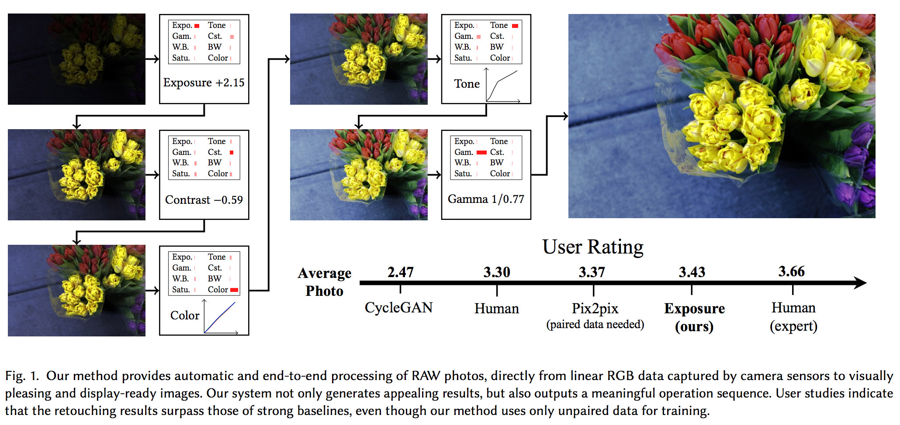
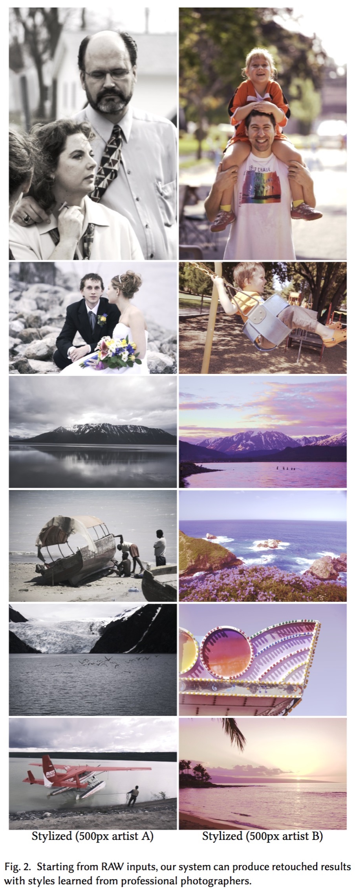
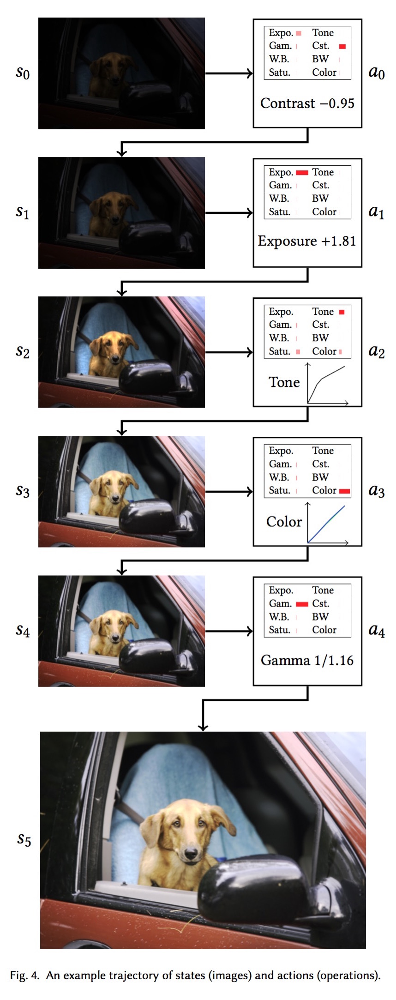
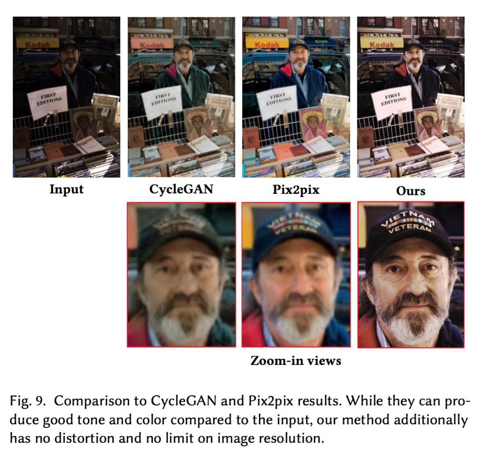
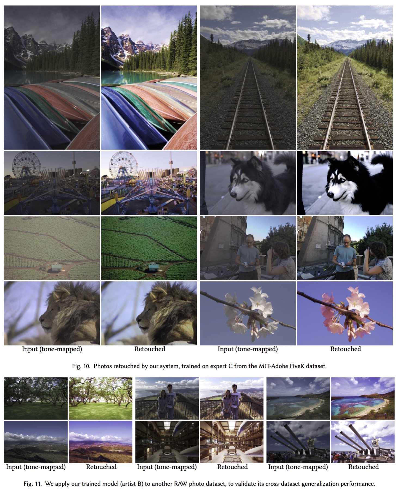
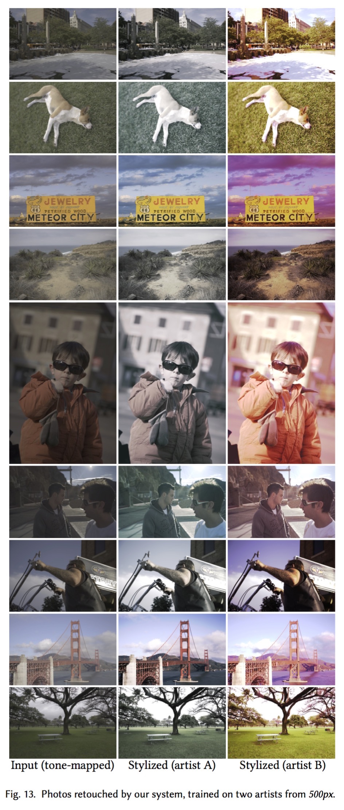
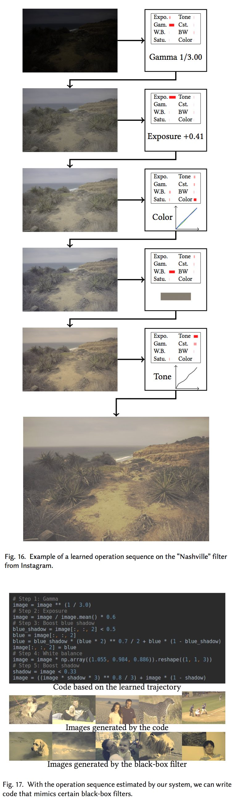

# **Exposure: A White-Box Photo Post-Processing Framework [[Paper](https://arxiv.org/abs/1709.09602)]**
**Change log (page under construction):**
 - March 9, 2018: Finished code clean-up. Uploaded code and some instructions.
 - March 1, 2018: Added some images.
 
 
 
### ACM Transactions on Graphics (to be presented at SIGGRAPH 2018)

[Yuanming Hu](http://taichi.graphics/me/), Microsoft Research & MIT CSAIL

[Hao He](https://github.com/hehaodele), Microsoft Research & MIT CSAIL

Chenxi Xu, Microsoft Research & Peking University

[Baoyuan Wang](https://sites.google.com/site/zjuwby/), Microsoft Research

[Stephen Lin](https://www.microsoft.com/en-us/research/people/stevelin/),  Microsoft Research




# Install
Requirements: `python3` and `tensorflow`. Tested on Ubuntu 16.04 and Arch Linux. OS X may work but Windows probably not. More cross-platform supports comming soon.
```
pip3 install tensorflow-gpu opencv-python tifffile scikit-image
git clone https://github.com/yuanming-hu/exposure --recursive
```
<!-- Make sure you have `pdflatex`, if you want to generate the steps. -->

# Use the pretrained model
 - `python3 evaluate.py example pretrained c.tiff`
 - Results will be generated at `outputs/`

# Train your own model (details comming soon)
  - Download and setup the [`MIT-Adobe FiveK Dataset`](https://data.csail.mit.edu/graphics/fivek/)
    * This can be a bit toublesome. More detailed instructions or automatic script coming soon.
  - `python3 train.py example` (This will load config_example.py)
  - Have a cup of tea (~100 min on a GTX 1080 Ti) 
  - Done!

# Visual Results

 





# FAQ
1) **Does it work on `jpg` or `png` images?**

To some extent, yes. `Exposure` is originally designed for RAW photos, which assumes 12+ bit color depth and linear "RGB" color space (or whatever we get after demosaicing). `jpg` and `png` images typically have only 8-bit color depth (except 16-bit `png`s) and the lack of information (dynamic range/activation resolution) may lead to suboptimal results. Moreover, `jpg` and most `png`s assume an `sRGB` color space, which contains a roughly `1/2.2` Gamma correction, making the data nonlinear.

Therefore, when applying `Exposure` to these images, such nonlinearity may slightly affect the result, as the pretrained model is trained on linearized color space from `ProPhotoRGB`.
  
If you train `Exposure` in your own collection of images that are `jpg`, it is OK to apply `Exposure` to similar `jpg` images. 

Note that `Exposure` is just a prototype (proof-of-concept) of our latest research, and there are definitely a lot of engineering efforts required to make it suitable for a real product. Like many deep learning system, usually when the inputs are too different from training data, suboptimal results will be generated. Defects like this may be allievated by more human engineering efforts which are not included in this research project whose goal is simply prototyping.

2) **Why am I getting different results everytime I run Exposure on the same image?**

If you read the paper, you will find that the system is learning a one-to-many mapping, instead of one-to-one.
The one-to-many mapping mechanism is achieved using randomness (noise vector in some other GAN papers), and therefore you may get slightly different results every time.

<!---
3) **Does retouching (post-processing) mean fabricating something fake? I prefer the jpg output images from my camera, which are true, realistic, and unmodified.**
Modern digital cameras have a built-in long post-processing pipeline. From the lens to the ultimate jpg image you get, lots of operations happen, such as A/D conversion, demosaicing, white balancing, denosing, AA/sharpening, tone mapping/Gamma correction etc., just to convert the sensor activation to display-ready photos.
"The jpg output images" are not necessarily unmodified. In fact, they are heavily processed results from the sensor. They can not even be considered realistic, as the built-in color constancy algorithm may not have done a perfect job and the resulting white balance may not accurately reflect what the photographer observes.
Note that perfectly reproducing what you see on the display is hardly possible, due to hardware limits of your cameras and displays. Retouching from RAWs does not always mean fabricating something - the photographer just needs to do it to render better what he sees and feels when he was taking the photo. Without post-processing, the binary bits from the camera sensors are not very useful, at least to human eyes. --->

# Bibtex
```
@article{hu2017exposure,
  title={Exposure: A White-Box Photo Post-Processing Framework},
  author={Hu, Yuanming and He, Hao and Xu, Chenxi and Wang, Baoyuan and Lin, Stephen},
  journal={arXiv preprint arXiv:1709.09602},
  year={2017}
}
```

# Disclaimer
 - This project is **NOT** built to take place of human artists, instead, we aim to provide better tools for artists, and many other people who are interested in digital photography.  
 - I recently upgraded components of `Exposure` e.g. (`Python` 2 to 3, `tensorflow` 1.0 to 1.6, `OpenCV` 2 to 3 etc.) to make future maintainance easier. However, I have done only a basic pass of testing, even though some upgrades contains breaking changes. This means this open-source version may have issues related to these upgrades. Please let me know if you find any problems!

# Related Research Projects and Implementations 
 - [Pix2pix and CycleGAN](https://github.com/junyanz/pytorch-CycleGAN-and-pix2pix)
 - [WGAN-tensorflow](https://github.com/Zardinality/WGAN-tensorflow)
